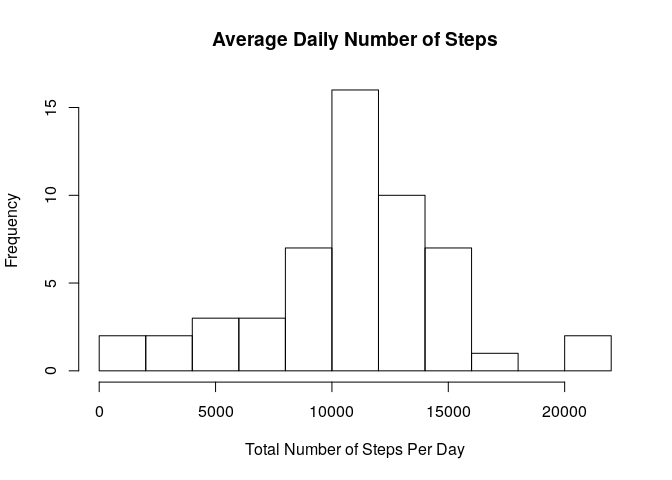
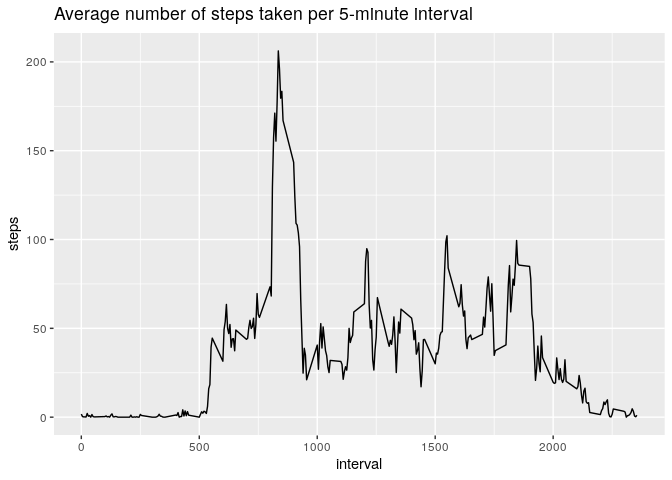
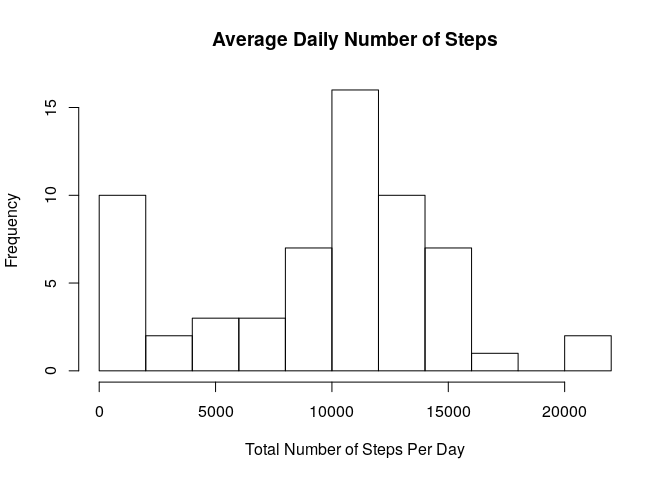
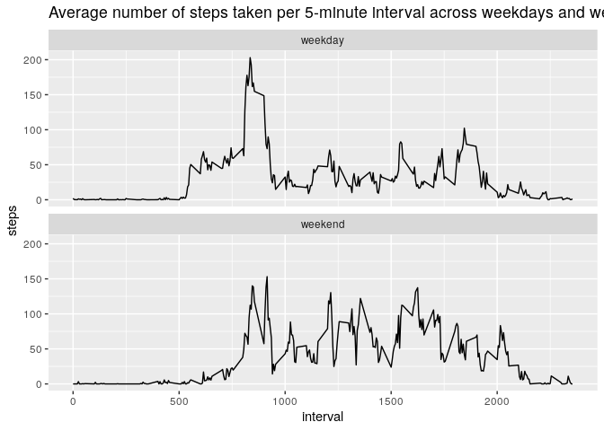

## Loading and preprocessing the data


```r
unzip("activity.zip", exdir=".", overwrite=TRUE)
activity <- read.csv("activity.csv")
head(activity)
```

```
##   steps       date interval
## 1    NA 2012-10-01        0
## 2    NA 2012-10-01        5
## 3    NA 2012-10-01       10
## 4    NA 2012-10-01       15
## 5    NA 2012-10-01       20
## 6    NA 2012-10-01       25
```


## What is mean total number of steps taken per day?


```r
totalDailySteps <- aggregate(steps ~ date, data = activity, sum)
hist(totalDailySteps$steps, breaks = 10, 
     xlab="Total Number of Steps Per Day",
     main = "Average Daily Number of Steps")
```

<!-- -->

```r
meanSteps <- mean(totalDailySteps$steps)
medianStep <- median(totalDailySteps$steps)
```
The average of the total number of steps taken per day is 10766.19 the median is 10765.


## What is the average daily activity pattern?


```r
library(ggplot2)

intervalSteps <- aggregate(steps ~ interval, data = activity, mean)
ggplot(intervalSteps, aes(x=interval, y=steps)) +
    geom_line() +
    ggtitle("Average number of steps taken per 5-minute interval")
```

<!-- -->

### Which 5-minute interval, on average across all the days in the dataset, contains the maximum number of steps?


```r
subset(intervalSteps, intervalSteps$steps == max(intervalSteps$steps, na.rm = TRUE))
```

```
##     interval    steps
## 104      835 206.1698
```

## Imputing missing values

How many values are missing?


```r
sum(is.na(activity$steps))
```

```
## [1] 2304
```

How are the missing values distributed?


```r
missingSteps <- subset(activity, is.na(steps))
missingDates <- unique(missingSteps$date)
missingIntervalCount <- length(unique(missingSteps$interval))
```
There are 8 dates and 288 intervals missing. Lets take a look at the dates:

```r
library(kableExtra)
kable(data.frame(date=missingDates))
```

<table>
 <thead>
  <tr>
   <th style="text-align:left;"> date </th>
  </tr>
 </thead>
<tbody>
  <tr>
   <td style="text-align:left;"> 2012-10-01 </td>
  </tr>
  <tr>
   <td style="text-align:left;"> 2012-10-08 </td>
  </tr>
  <tr>
   <td style="text-align:left;"> 2012-11-01 </td>
  </tr>
  <tr>
   <td style="text-align:left;"> 2012-11-04 </td>
  </tr>
  <tr>
   <td style="text-align:left;"> 2012-11-09 </td>
  </tr>
  <tr>
   <td style="text-align:left;"> 2012-11-10 </td>
  </tr>
  <tr>
   <td style="text-align:left;"> 2012-11-14 </td>
  </tr>
  <tr>
   <td style="text-align:left;"> 2012-11-30 </td>
  </tr>
</tbody>
</table>

Since there are full days missing, in one case even consecutive days I decided to replace all NA values with 0.


```r
activity$steps[is.na(activity$steps)] <- 0
```

Here is the updated histogram.

```r
totalDailySteps <- aggregate(steps ~ date, data = activity, sum)
hist(totalDailySteps$steps, breaks = 10, 
     xlab="Total Number of Steps Per Day",
     main = "Average Daily Number of Steps")
```

<!-- -->

```r
meanSteps <- mean(totalDailySteps$steps)
medianStep <- median(totalDailySteps$steps)
```
The new average of the total number of steps taken per day is 9354.23 the median is 10395.0. They are lower than before because of the added zeros.


## Are there differences in activity patterns between weekdays and weekends?

```r
library(chron)
library(ggplot2)
library(tidyr)

isWeekend <- is.weekend(as.Date(activity$date))

weekendSteps <- aggregate(steps ~ interval, data = activity[isWeekend,], mean)
weekdaySteps <- aggregate(steps ~ interval, data = activity[!isWeekend,], mean)
merged <- merge(weekdaySteps, weekendSteps, by = "interval")
names(merged) <- c("interval", "weekday", "weekend")
df <- pivot_longer(merged, contains("week"), names_to = "day",
                 values_to = "steps")
df$day <- as.factor(df$day)

ggplot(df, aes(x=interval, y=steps)) +
    geom_line() +
    facet_wrap(~day, ncol = 1) +
    ggtitle("Average number of steps taken per 5-minute interval across weekdays and weekends")
```

<!-- -->


It seems that the activity on weekends is more evenly distributed during the day. The bulk of activity during weekdays happends in the morning.
